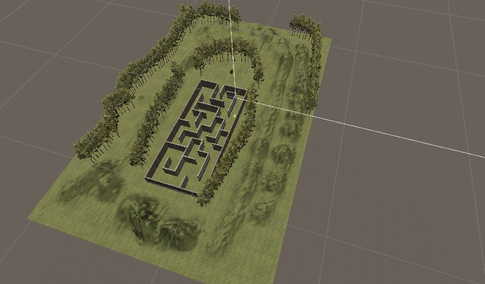

# ProyectoFinal - Ander Gil Moro

## Introducción y cuestiones importantes para el uso
Como proyecto final de la asignatura, se nos pidió crear desde cero un juego de Realidad Virtual (VR), usando paquetes que facilita Google (Cardboard). Yo decidí crear un juego de tipo laberinto: el objetivo principal del juego es escapar del laberinto en el que nos encontramos al iniciar la aplicación.

En el juego, podremos desplazarnos hacia delante usando el botón izquierdo del ratón (o pulsando en la pantalla de nuestro teléfono móvil). Al comienzo pensé en la idea de poder andar hacia detrás, pero tras considerarlo, he quitado esta posibilidad para hacer el juego más realista, ya que no tiene mucho sentido movernos sin mirar hacia donde estamos yendo.

En el laberinto nos podremos encontrar con dos enemigos. Disponemos de dos balas de munición. Podremos disparar clicando el botón central del ratón (la rueda). No sé a que control corresponde en un teléfono móvil. Si nos quedamos sin munición, podremos salir igualmente, pero en ese caso, habrá que esquivar a los enemigos. Si un enemigo nos atrapa (entra en contacto con el jugador) nos devolverá al principio del laberinto y se nos recargará la munición.

## Primeros pasos: configuración para RV e importar paquetes
Una vez tenida en mente la idea principal, los primeros pasos fueron configurar la aplicación para que admitiese el formato de VR. Para ello, seguí los mismos pasos de cuando realizamos el proyecto de Google Cardboard.    
Primero, importé el paquete **GoogleVRForUnity_1.200.1.unitypackage** que ya tenía descargado. Después, en File -> Build Settings, cambié la plataforma a Android.  
Luego realicé varios cambios en la pestaña Player de Player Settings:
1. Seleccioné **XR Settings** y marqué la casilla **Virtual Reality Supported**. Pulsé en + y añadí **CardBoard**.
2. En Other Settings, seleccioné **Vulcan** y cliqué en - para eliminarlo. También eliminé **OpenGLES3** de la misma forma y añadí **OpenGLES2** pulsando en +.

Los siguientes pasos los realicé en el SampleScene:
1. Creé un objeto vacío en la raíz (que después se convertirá en el propio jugador) y añadí la MainCamera como su hijo. Reseteé el Transform de la cámara en el inspector de objetos en el menú que se abre al clicar en los 3 puntos.
2. En Project, busqué el GameObject **GvrReticlePointer** y lo añadí como hijo de la MainCamera.
2. En Project, busqué los GameObjects **GvrEditorEmulator** y **GvrEventSystem** y añadí ambos en la raíz.
3. En project, busqué el script **GvrPointerPhysicsRaycaster** y se lo asigné a la cámara para poder interactuar con los objetos de la escena.

Una vez realizados estos pasos, la escena ya estaba lista para ser jugada en VR.

Un aspecto importante que ha mejorado mi uso de Unity ha sido buscar y trabajar con variados Assets diferentes. En el proyecto, he trabajado con los siguientes assests:
1. **Concrete texture pack**, para las texturas del laberinto.
2. **Grass flowers**, para que el terreno del juego fuese un poco más bonito y realista.
3. **Standard Assets**, para usar los árboles del paquete.
4. **ChestFree**, para el cofre que conseguimos al salir del laberinto.
5. **ExplosiveLLC**, un paquete de videjuegos RPG que trae muchas funcionalidades, demasiado complejas para mi conocimiento en Unity. Lo he usado para los enemigos que nos encontraremos en el laberinto.
6. Por último, obviamente, los necesarios para la realidad virtual.

## Creando el laberinto

Para crear el laberinto, creé objetos 3D y les dí forma para que tuviesen forma de pared. Tras emplazar todas las paredes de manera que tuviesen forma laberíntica, añadí dos enemigos del paquete **ExplosiveLLC**. Estos enemigos se mueven a través del laberinto y nos devolverán al comienzo del laberinto si nos atrapan. También añadí un cofre a la salida del laberinto, como premio simbólico de que hemos logrado escapar.

## Scripts e hitos de programación

El juego se constituye por dos scripts principales: CharacterController, para el jugador, y EnemyController, para el enemigo. Ambos son **cuerpos rígidos y son afectados por la gravedad**. También hay otros dos scripts: PointerEventController y SceneController.

En CharacterController, he añadido la opción de **Reconocimiento por voz** (solo disponible en Windows): diciendo la palabra "Avanza", el jugador avanzará automáticamente y el usuario solamente deberá mirar hacia la dirección en la que quiere moverse. Si el usuario dice "para", el jugador se parará. Por otro lado, el usuario también podra hacer **avanzar** al jugador pulsando el click izquiero del ratón. 

En EnemyController, los enemigos están programados para siempre avanzar hacia adelante. Si el enemigo colisiona (aplicación de **colisiones**) contra una pared, girará 180 grados y seguirá avanzando. En cambio, si colisiona contra el jugador, lo devolverá al comienzo del laberinto.

En PointerEventController (un tipo de **Event Trigger** de VR), se preparará la escena para que el jugador pueda disparar al enemigo al que esté **apuntando** (ReticlePointer de VR).

SceneController se encarga del **evento delegado** Shoot, al que se suscribirá el enemigo y se activará al pulsar el botón central del ratón. Si el enemigo estaba siendo apuntado por el jugador (detectado con PointerEventController), este desaparecerá.

## Sensores y aspectos a destacar

A pesar de que en la práctica de sensores ya implementé los tres sensores (acelerómetro, brújula y GPS), he intentado implementar de nuevo el GPS y la brújula, pero no he conseguido que funcionen.  
La idea del GPS era imprimir las coordenadas de cuando el jugador "muere" si le atrapa un enemigo, pero siempre dice que no se puede acceder al GPS.  
Por otro lado, al tratarse de una aplicación de VR, el jugador cambia su dirección de mirada, pero en realidad no rota su posición respecto al norte. Por lo tanto, la brújula permanecía siempre estática, así que la he eliminado.

En los aspectos a destacar, además de los hitos descritos anteriormente, mencionaría el uso de **texturas**, **UI** (para la munición) y **creación de terreno** en la escena. No había trabajado en estos aspectos anteriormente. También, como he mencionado al comienzo, destacaría el **uso de paquetes de la Assets Store**. 

## Acta de los acuerdos del grupo

La aplicación ha sido desarrollada únicamente por mí. Por lo que todas las tareas han sido realizadas de forma individual: la preparación de la escena, búsqueda de información, los scripts, la realización de este informe, etcétera.

## Ejemplos de muestra del juego

A continuación se muestran algunas pruebas de ejecución:

**Muestra de la escena:**  

**Muestra del movimiento en VR y el reconocimiento de voz:**  

**Muestra de matar a un enemigo.** Como se puede ver, se falla el primer disparo, y con el segundo, conseguimos eliminar al enemigo.

**Muestra de ser atrapado por enemigo:**

**Saliendo del laberinto:**

